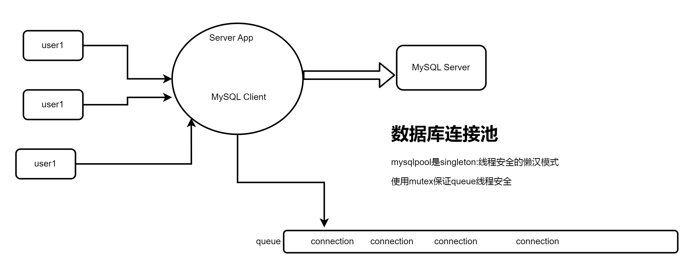
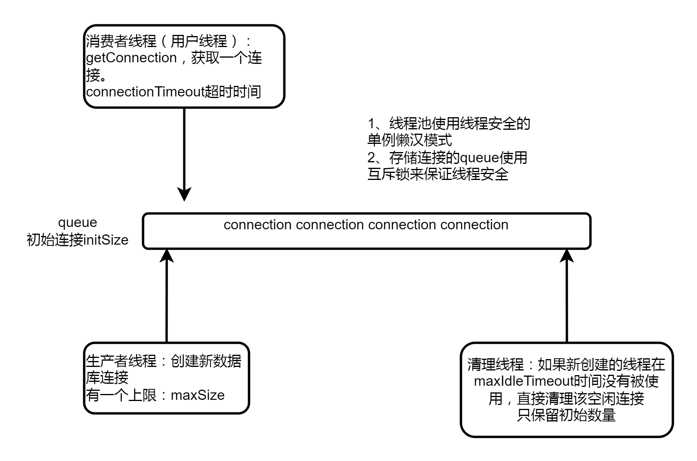

### c++库：mysqlpoo数据库连接池

#### 使用

```
编译动态库，库放在lib下，头文件在include下，编译后测试代码的可执行文件在build下，请自行观看CMakeLists.txt
```

```shell
git clone 厂库地址
cd mysqlpool
```
```
#请修改mysql.cnf中的配置项，下面四项的=后面改为真实的数据库配置
ip=127.0.0.1
port=3306
username=name
password=pass
dbname=db

如果想运行测试代码，请在数据库中创建表：
```
```shell
CREATE TABLE user (
    id INT(11) NOT NULL AUTO_INCREMENT,
    name VARCHAR(50),
    age INT(11),
    sex ENUM('male', 'female'),
    PRIMARY KEY (id)
);
```


**编译库以及编译测试代码，请自行观看CMakeLists.txt**
```shell

mkdir build && cd builid && cmake .. && make

```

#### 项目背景
```
1、提高数据库的访问瓶颈，除了在服务器增加缓存服务器缓存常用的数据（redis）,也可以增加连接池，提高MySQL Server的访问效率。
2、在高并发情况下，大量的**TCP三次握手、MySQL Server连接认证、MySQLbu关闭以及TCP四次挥手**所耗费的性能时间也是很明显的。增加连接池就是为了减少这部分损耗。
3、优点：对短时间内大量的增删改查操作提升是很明显的
```
#### 连接池功能点


```
连接池包括数据库连接所用的ip地址、port端口号、用户名和密码、以及其他性能参数，如下：

1、初始连接数（initSize）:连接池事先会和mysql server 创建initSize个connection连接
2、最大连接数量（maxSize）:当并发访问MySQL Serve的请求突然增多时，初始连接量已经不够用了，会根据新请求数量创建更多的连接给应用使用，但是创建的连接数有一个上限maxSize。
3、最大空闲时间(maxIdleTime) :当访问mysql的并发请求增多时，连接池中的连接数量会动态增加，上限时maxSize,当这些连接使用完后放到池中。但是，如果在指定的maxIdleTime时间段后，这些新增的连接还没有被使用，那么新增加的这些资源就要被回收，只需要保持初始连接量即可。
4、连接超时时间(connetionTimeout):当访问MySQL的访问量过大，连接池中的连接数量已经达到maxSize了，而此时没有空闲的连接可以用，那么此时应用从连接池获取连接无法成功，它通过阻塞的方式获取连接的时间如果超过connectionTimeout,那么获取连接失败，无法访问数据库。

```

#### 核心代码
Connection.cc

CommonConnectionPool.cc

#### 连接池压力测试
```
再使用连接池和不使用连接池的情况下
分别使用单线程和多线程、并发访问数量1000、5000、10000来测试执行单个数据的插入平均用时，表格如下：

```
**云服务配置**
| 配置项         | 规格       |
| -------------- | ------------ |
| 服务商         | 腾讯云   |
| 实例类型       | 轻量应用服务器 |
| CPU 核数       | 2            |
| 内存大小       | 2 GB           |
| 存储类型       | SSD           |
| 存储容量       | 50 Gb          |
| 网络类型       | 内网           |


```
MySQL version:mysql  Ver 8.0.36-0ubuntu0.22.04.1 for Linux on x86_64 ((Ubuntu))
```

**表中结果是插入这么多条数量的总耗时。**

| 数据量   | 不使用连接池&&单线程(ms) | 不使用连接池&&4线程(ms) | 使用连接池&&单线程(ms) | 使用连接池&&4线程(ms) |
|----------|----------------------|-----------------------|-----------------------|----------------------|
| 1000     | 14408                | 5130                  | 7286                  | 2337                 |
| 5000     | 69166                | 26773                 | 34019                 | 10948                |
| 10000    | 144144               | 52057                 | 73607                 | 22838                |


压力测试代码